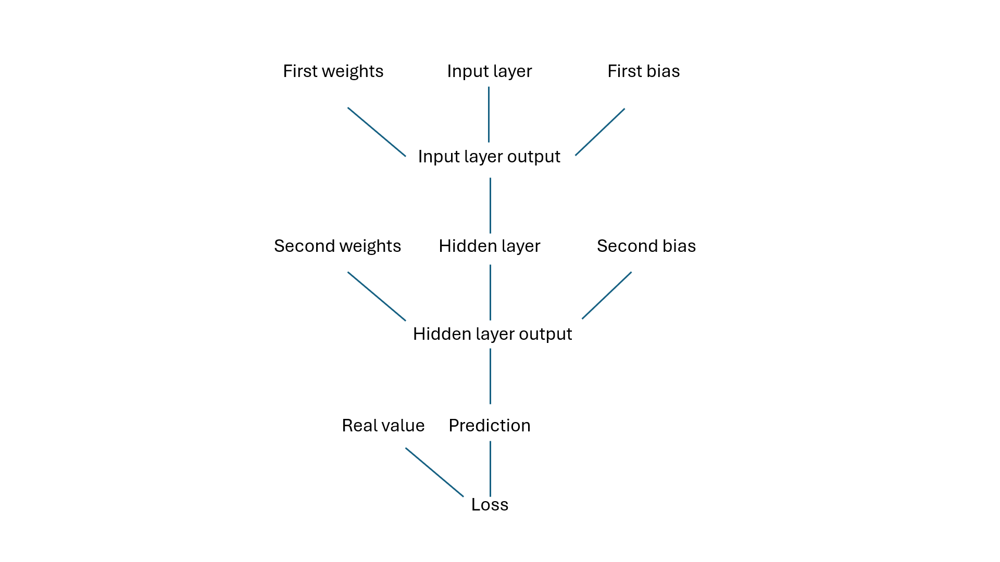
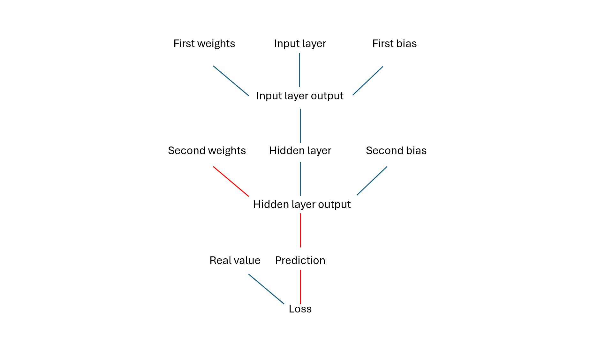
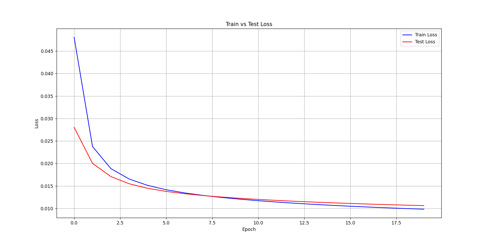
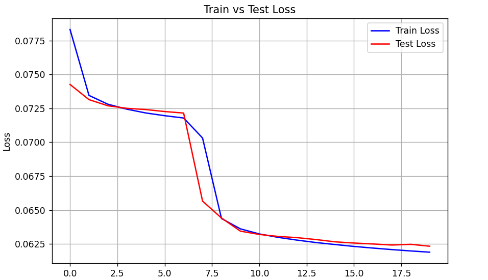

**One-hidden layer perceptron**

**By Volodymyr Kostenko**

**Introduction**

This perceptron was created without using PyTorch, TensorFlow, or Scikit-learn in order to gain a better understanding of how a perceptron works. The perceptron is designed for a classification task, specifically predicting digits from 0 to 9. The MNIST dataset is used, which contains digits from 0 to 9 represented as 28×28 pixel black-and-white images. You can explore the dataset in more detail on these websites:

http://yann.lecun.com or https://www.kaggle.com/datasets/hojjatk/mnist-dataset/data.

**Perceptron architecture**

The perceptron consists of:

1.  784 input signals (one for each pixel)
2.  20 hidden neurons (chosen randomly, can be modified when tuning the model)
3.  10 output signals (one for each digit)
4.  Biases (set to zero)
5.  15,880 weights

The activation function is a sigmoid, since it is used to calculate the probability of selecting a particular digit.

$$
\sigma ( x ) = \  \frac{1}{1 - \exp^{- x}}
$$

**Input data**

The input data is stored in idx3-ubyte and idx1-ubyte formats. The data is read as follows:

1.  Read the header (4 bytes for the "magic number", then 4 bytes for each dimension, as indicated by the number before -ubyte).
2.  Read the remaining data using np.frombuffer.
3.  After reading the images, reshape the NumPy array into a 3D array.
4.  Normalize the pixel values so that they are in the range 0 to 1.

**Initializing data**

The data is initialized as follows:

1.  The 28×28 image is flattened into a vector of 784 previously normalized pixel values.
2.  The label is initialized as a vector of zeros with a single one (for example, if the digit is 5, then label_vector = [0,0,0,0,0,1,0,0,0,0]. This means the probability of other digits is 0%, and the probability of the correct digit is 100%).
3.  The weights are matrices initialized with random floating-point values in the range from -1 to 1, with dimensions input_size × hidden_size and hidden_size × output_size, respectively.
4.  The biases are initialized as zero vectors with dimensions hidden_size and output_size, respectively.

**Model training**

The model is trained for 20 epochs with a learning rate of 0.1 (both values were chosen randomly and can be modified when tuning the model). The training dataset consists of 60,000 images and their corresponding labels.

1.  **Forward propagation**

Forward propagation is performed by multiplying the input signals by their corresponding weights, adding a bias to each hidden neuron, and applying the sigmoid activation function.

$$
a_{1} = \sigma ( a_{0} * w_{0} + b_{0} )
$$

Where:

1.  $$a_{1}$$ — the next layer
2.  $$a_{0}$$ — the previous layer
3.  $$w_{0}$$ — the weights connecting $$a_{0}$$→ $$a_{1}$$
4.  $$b_{0}$$ — the bias for $$a_{1}$$
5.  **Backpropagation**

Backpropagation is performed according to the chain rule (i.e., the derivative of the loss with respect to a weight is equal to the product of the derivatives along the path leading to that weight). Let’s imagine the perceptron as a tree consisting of connections.

Then, to reach the weights $$w_{2}$$ from the loss, you need to traverse the tree in the following way:

And then our formula will take the following form:

$$
\frac{\partial L}{\partial w_{2}} = \frac{\partial L}{\partial p r e d} * \  \frac{\partial p r e d}{\partial h i d o u t} * \  \frac{\partial h i d o u t}{\partial w_{2}}
$$

Where:

1.  $$L$$ — the loss function (in this case, MSE — Mean Squared Error)
2.  $$p r e d$$ — the output signal (prediction)
3.  $$h i d o u t$$ — the output of the hidden layer (the weighted sum before activation)
4.  $$w_{2}$$ — the second weights (hidden layer → prediction)

Before this analogy, we do the same for all weights and biases**.**

**…**

After performing backpropagation, we calculate the new weights and biases using this formula where $$w \slash b$$ = weights or bias:

$$
w \slash b = w \slash b - \  l e a r n i n g \  r a t e * \frac{\partial L}{\partial w \slash b}
$$

**Model testing**

The testing dataset consists of 10,000 images and their corresponding labels. Testing uses only forward propagation. During training and testing, the average training / testing loss per epoch is calculated using the following formula:

$$
t r a i n \slash t e s t \  \  e p o c h \  l o s e \  = \  \frac{\sum_{i = 1}^{\frac{t r a i n}{t e s t} \  i m a g e s \  c o u n t} {M S E}}{\frac{t r a i n}{t e s t} \  i m a g e s \  c o u n t}
$$

These errors were stored in lists of training/testing errors, which were later used to create the train/test loss graph.

**Addition to the documentation:**

1.  The sigmoid activation function is also used in the hidden layer because ReLU increases the error. Below is the train–test loss graph with the same hyperparameter values but using the ReLU activation function:

    

It may be related to the small model size, computing the epoch loss using MSE, or the small number of training epochs.
